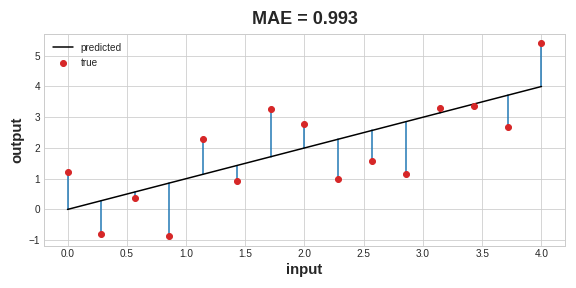
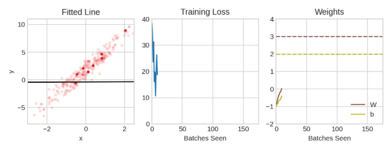
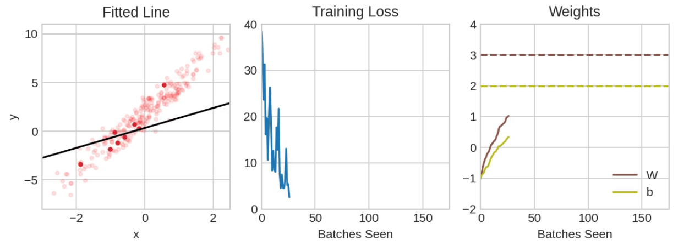
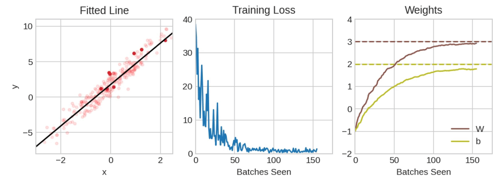

# Descenso de Gradiente Estocástico

Usá Keras y Tensorflow para entrenar tu primera red neuronal.

## Introducción

En las dos primeras lecciones, aprendimos cómo construir redes totalmente conectadas a partir de pilas de capas densas. Cuando se crea por primera vez, todos los pesos de la red se establecen aleatoriamente: la red todavía no "sabe" nada. En esta lección vamos a ver cómo entrenar una red neuronal; vamos a ver cómo aprenden las redes neuronales.

Como en todas las tareas de Machine Learning, comenzamos con un conjunto de datos de entrenamiento. Cada ejemplo en los datos de entrenamiento consiste en algunas características (las entradas) junto con un objetivo esperado (la salida). Entrenar la red significa ajustar sus pesos de tal manera que pueda transformar las características en el objetivo. En el conjunto de datos *80 Cereals*, por ejemplo, queremos una red que pueda tomar el contenido de `'sugar'`, `'fiber'` y `'protein'` de cada cereal y producir una predicción para las `'calories'` de ese cereal. Si podemos entrenar exitosamente una red para hacer eso, sus pesos deben representar de alguna manera la relación entre esas características y ese objetivo tal como se expresa en los datos de entrenamiento.

Además de los datos de entrenamiento, necesitamos dos cosas más:

- Una "función de pérdida" que mida qué tan buenas son las predicciones de la red.
- Un "optimizer" que pueda indicarle a la red cómo cambiar sus pesos.

## La Función de Pérdida

Hemos visto cómo diseñar una arquitectura para una red, pero no hemos visto cómo decirle a la red qué problema resolver. Esta es la tarea de la función de pérdida.

La función de pérdida mide la disparidad entre el valor verdadero del objetivo y el valor que predice el modelo.

Diferentes problemas requieren diferentes funciones de pérdida. Hemos estado observando problemas de regresión, donde la tarea es predecir algún valor numérico: *calories* en *80 Cereals*, *rating* en *Red Wine Quality*. Otros problemas de regresión podrían ser predecir el precio de una casa o la eficiencia de combustible de un auto.

Una función de pérdida común para problemas de regresión es el *mean absolute error* o MAE. Para cada predicción $y_{\text{pred}}$, MAE mide la disparidad con el valor verdadero $y_{\text{true}}$ mediante la diferencia absoluta $\text{abs}(y_{\text{true}} - y_{\text{pred}})$.

La pérdida total MAE en un conjunto de datos es el promedio de todas estas diferencias absolutas.



El *mean absolute error* es la longitud promedio entre la curva ajustada y los puntos de datos.

Además del MAE, otras funciones de pérdida que podrías ver para problemas de regresión son el *mean-squared error* (MSE) o la pérdida de Huber (ambas disponibles en Keras).

Durante el entrenamiento, el modelo utilizará la función de pérdida como guía para encontrar los valores correctos de sus pesos (una pérdida menor es mejor). En otras palabras, la función de pérdida le dice a la red cuál es su objetivo.

## El Optimizer - Descenso de Gradiente Estocástico

Hemos descrito el problema que queremos que la red resuelva, pero ahora necesitamos decir cómo resolverlo. Esta es la tarea del *optimizer*. El *optimizer* es un algoritmo que ajusta los pesos para minimizar la pérdida.

Prácticamente todos los algoritmos de optimización usados en *deep learning* pertenecen a una familia llamada *stochastic gradient descent*. Son algoritmos iterativos que entrenan una red en pasos. Un paso de entrenamiento funciona así:

1. Se toma una muestra de los datos de entrenamiento y se ejecuta a través de la red para hacer predicciones.
2. Se mide la pérdida entre las predicciones y los valores verdaderos.
3. Finalmente, se ajustan los pesos en una dirección que haga que la pérdida sea menor.

Luego se repite esto una y otra vez hasta que la pérdida sea tan pequeña como se desee (o hasta que no pueda disminuir más).






 
Entrenando una red neuronal con *Stochastic Gradient Descent*.

Cada muestra de datos de entrenamiento en una iteración se llama *minibatch* (o a menudo simplemente "batch"), mientras que una pasada completa por los datos de entrenamiento se llama *epoch*. El número de *epochs* que entrenes indica cuántas veces la red verá cada ejemplo de entrenamiento.

La animación muestra el modelo lineal de la Lección 1 siendo entrenado con SGD. Los puntos rojo pálido representan todo el conjunto de entrenamiento, mientras que los puntos rojo sólido son los *minibatches*. Cada vez que SGD ve un nuevo *minibatch*, ajustará los pesos ($w$ la pendiente y $b$ la intersección en $y$) hacia sus valores correctos en ese lote. Batch tras batch, la línea eventualmente converge a su mejor ajuste. Podés ver que la pérdida disminuye a medida que los pesos se acercan a sus valores verdaderos.

## Learning Rate y Batch Size

Notá que la línea solo hace un pequeño desplazamiento en la dirección de cada batch (en lugar de moverse completamente). El tamaño de estos desplazamientos está determinado por el *learning rate*. Un *learning rate* más pequeño significa que la red necesita ver más *minibatches* antes de que sus pesos converjan a sus mejores valores.

El *learning rate* y el tamaño de los *minibatches* son los dos parámetros que más afectan cómo procede el entrenamiento con SGD. Su interacción a menudo es sutil y la elección correcta de estos parámetros no siempre es obvia. (Exploraremos estos efectos en el ejercicio.)

Afortunadamente, para la mayoría de los trabajos no será necesario hacer una búsqueda extensa de hiperparámetros para obtener resultados satisfactorios. *Adam* es un algoritmo SGD que tiene un *learning rate* adaptativo que lo hace adecuado para la mayoría de los problemas sin necesidad de ajustar parámetros (es "autoajustable", en cierto sentido). Adam es un excelente *optimizer* de propósito general.

## Agregando la Función de Pérdida y el Optimizer

Después de definir un modelo, podés agregar una función de pérdida y un *optimizer* con el método `compile` del modelo:

```python
model.compile(
    optimizer="adam",
    loss="mae",
)
````

Notá que podemos especificar la pérdida y el *optimizer* simplemente con un string. También podés acceder a ellos directamente a través de la API de Keras, si quisieras ajustar parámetros, por ejemplo, pero para nosotros, los valores por defecto funcionarán bien.

## ¿Qué hay en un Nombre?

El gradiente es un vector que nos dice en qué dirección deben moverse los pesos. Más precisamente, nos indica cómo cambiar los pesos para que la pérdida cambie más rápido. Llamamos a nuestro proceso *gradient descent* porque utiliza el gradiente para descender por la curva de pérdida hacia un mínimo. *Stochastic* significa "determinado por azar". Nuestro entrenamiento es estocástico porque los *minibatches* son muestras aleatorias del conjunto de datos. ¡Y por eso se llama SGD!

## Ejemplo - Red Wine Quality

Ahora sabemos todo lo que necesitamos para empezar a entrenar modelos de *deep learning*. ¡Veamoslo en acción! Usaremos el conjunto de datos *Red Wine Quality*.

Este conjunto de datos consiste en mediciones fisicoquímicas de aproximadamente 1600 vinos tintos portugueses. También se incluye una calificación de calidad para cada vino obtenida mediante pruebas a ciegas. ¿Qué tan bien podemos predecir la calidad percibida de un vino a partir de estas mediciones?

Hemos puesto toda la preparación de datos en la siguiente celda oculta. No es esencial para lo que sigue, así que podés omitirla. Una cosa que podés notar por ahora es que hemos reescalado cada característica para que esté en el intervalo

$$
[0, 1]
$$

Como discutiremos más en la Lección 5, las redes neuronales tienden a rendir mejor cuando sus entradas están en una escala común.

| fixed acidity | volatile acidity | citric acid | residual sugar | chlorides | free sulfur dioxide | total sulfur dioxide | density | pH   | sulphates | alcohol | quality |
| ------------- | ---------------- | ----------- | -------------- | --------- | ------------------- | -------------------- | ------- | ---- | --------- | ------- | ------- |
| 10.8          | 0.470            | 0.43        | 2.10           | 0.171     | 27.0                | 66.0                 | 0.99820 | 3.17 | 0.76      | 10.8    | 6       |
| 8.1           | 0.820            | 0.00        | 4.10           | 0.095     | 5.0                 | 14.0                 | 0.99854 | 3.36 | 0.53      | 9.6     | 5       |
| 9.1           | 0.290            | 0.33        | 2.05           | 0.063     | 13.0                | 27.0                 | 0.99516 | 3.26 | 0.84      | 11.7    | 7       |
| 10.2          | 0.645            | 0.36        | 1.80           | 0.053     | 5.0                 | 14.0                 | 0.99820 | 3.17 | 0.42      | 10.0    | 6       |

¿Cuántas entradas debería tener esta red? Podemos descubrirlo observando el número de columnas en la matriz de datos. Asegurate de no incluir el objetivo ('quality') aquí, solo las características de entrada.

```python
print(X_train.shape)
# (1119, 11)
```

Once columnas significan once entradas.

Hemos elegido una red de tres capas con más de 1500 neuronas. Esta red debería ser capaz de aprender relaciones bastante complejas en los datos.

```python
from tensorflow import keras
from tensorflow.keras import layers

model = keras.Sequential([
    layers.Dense(512, activation='relu', input_shape=[11]),
    layers.Dense(512, activation='relu'),
    layers.Dense(512, activation='relu'),
    layers.Dense(1),
])
```

Decidir la arquitectura de tu modelo debería ser parte de un proceso. Comenzá simple y usá la pérdida de validación como guía. Aprenderás más sobre desarrollo de modelos en los ejercicios.

Después de definir el modelo, compilamos el *optimizer* y la función de pérdida.

```python
model.compile(
    optimizer='adam',
    loss='mae',
)
```

¡Ahora estamos listos para comenzar el entrenamiento! Le hemos dicho a Keras que al *optimizer* le alimente 256 filas de los datos de entrenamiento a la vez (*batch\_size*) y que haga esto 10 veces a lo largo del conjunto de datos (*epochs*).

```python
history = model.fit(
    X_train, y_train,
    validation_data=(X_valid, y_valid),
    batch_size=256,
    epochs=10,
)
```

```
Epoch 1/10
5/5 [==============================] - 1s 66ms/step - loss: 0.2470 - val_loss: 0.1357
Epoch 2/10
5/5 [==============================] - 0s 21ms/step - loss: 0.1349 - val_loss: 0.1231
Epoch 3/10
5/5 [==============================] - 0s 23ms/step - loss: 0.1181 - val_loss: 0.1173
Epoch 4/10
5/5 [==============================] - 0s 21ms/step - loss: 0.1117 - val_loss: 0.1066
Epoch 5/10
5/5 [==============================] - 0s 22ms/step - loss: 0.1071 - val_loss: 0.1028
Epoch 6/10
5/5 [==============================] - 0s 20ms/step - loss: 0.1049 - val_loss: 0.1050
Epoch 7/10
5/5 [==============================] - 0s 20ms/step - loss: 0.1035 - val_loss: 0.1009
Epoch 8/10
5/5 [==============================] - 0s 20ms/step - loss: 0.1019 - val_loss: 0.1043
Epoch 9/10
5/5 [==============================] - 0s 19ms/step - loss: 0.1005 - val_loss: 0.1035
Epoch 10/10
5/5 [==============================] - 0s 20ms/step - loss: 0.1011 - val_loss: 0.0977
```

Podés ver que Keras te mantendrá actualizado sobre la pérdida a medida que el modelo entrena.

A menudo, una mejor manera de visualizar la pérdida es graficarla. El método `fit` de hecho mantiene un registro de la pérdida producida durante el entrenamiento en un objeto *History*. Convertiremos los datos a un *DataFrame* de Pandas, lo que facilita la visualización.

```python
import pandas as pd

# convertir el historial de entrenamiento a un dataframe
history_df = pd.DataFrame(history.history)
# usar el método de graficado nativo de Pandas
history_df['loss'].plot();
```

Notá cómo la pérdida se estabiliza a medida que avanzan las *epochs*. Cuando la curva de pérdida se vuelve horizontal de esta manera, significa que el modelo ha aprendido todo lo que puede y no habría razón para continuar con más *epochs*.

```
```
