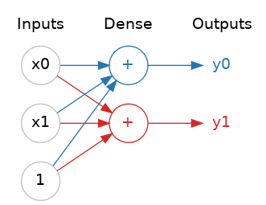
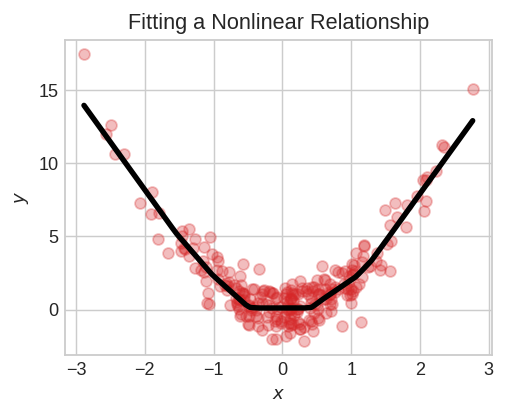
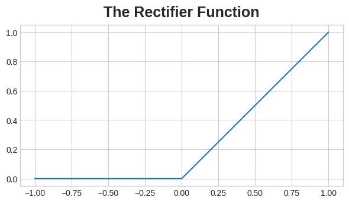
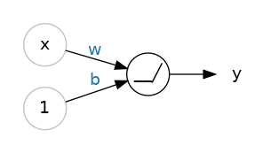
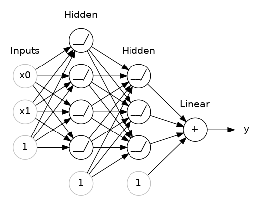

$y = w x + b$

$$ 
y = w_0 x_0 + w_1 x_1 + w_2 x_2 + b 
$$

# Redes Neuronales Profundas

Agregá capas ocultas a tu red para descubrir relaciones complejas.

## Introducción

En esta lección vamos a ver cómo podemos construir redes neuronales capaces de aprender los tipos complejos de relaciones por los que son famosas las deep neural nets.

La idea clave aquí es la modularidad, construir una red compleja a partir de unidades funcionales más simples. Hemos visto cómo una unidad lineal calcula una función lineal — ahora veremos cómo combinar y modificar estas unidades individuales para modelar relaciones más complejas.

## Capas

Las redes neuronales típicamente organizan sus neuronas en capas. Cuando agrupamos unidades lineales que tienen un conjunto común de entradas, obtenemos una *dense layer*.


 
Una *dense layer* de dos unidades lineales recibiendo dos entradas y un *bias*.  

Podrías pensar en cada capa de una red neuronal como realizando algún tipo de transformación relativamente simple. A través de una pila profunda de capas, una red neuronal puede transformar sus entradas de maneras cada vez más complejas. En una red neuronal bien entrenada, cada capa es una transformación que nos acerca un poco más a una solución.

    Muchos Tipos de Capas

    Una "layer" en Keras es un tipo de cosa muy general. Una capa puede ser, esencialmente, cualquier tipo de transformación de datos. Muchas capas, como las *convolutional* y *recurrent layers*, transforman datos mediante el uso de neuronas y difieren principalmente en el patrón de conexiones que forman. Otras, en cambio, se utilizan para *feature engineering* o simplemente aritmética básica. Hay todo un mundo de capas por descubrir — ¡explóralas!

## La Función de Activación

Resulta que, sin embargo, dos *dense layers* sin nada en el medio no son mejores que una sola *dense layer* por sí sola. Las *dense layers* por sí mismas nunca pueden sacarnos del mundo de líneas y planos. Lo que necesitamos es algo no lineal. Lo que necesitamos son funciones de activación.



Sin funciones de activación, las redes neuronales solo pueden aprender relaciones lineales. Para poder ajustar curvas, necesitaremos usar funciones de activación.  

Una función de activación es simplemente alguna función que aplicamos a cada una de las salidas de una capa (sus activaciones). La más común es la función *rectifier*:

\[
\max(0, x)
\]



La función *rectifier* tiene un gráfico que es una línea con la parte negativa "rectificada" a cero. Aplicar la función a las salidas de una neurona pondrá una curvatura en los datos, alejándonos de líneas simples.

Cuando conectamos el *rectifier* a una unidad lineal, obtenemos una *rectified linear unit* o ReLU. (Por esta razón, es común llamar a la función *rectifier* la "función ReLU"). Aplicar una activación ReLU a una unidad lineal significa que la salida se convierte en:

\[
\max(0, w \cdot x + b)
\]

lo que podríamos representar en un diagrama como:



Una *rectified linear unit*.  

## Apilando Dense Layers

Ahora que tenemos algo de no linealidad, veamos cómo podemos apilar capas para obtener transformaciones de datos complejas.



Una pila de *dense layers* forma una red "fully-connected".  

Las capas antes de la capa de salida a veces se llaman *hidden* ya que nunca vemos sus salidas directamente.

Ahora, notá que la capa final (*output layer*) es una unidad lineal (es decir, sin función de activación). Eso hace que esta red sea apropiada para una tarea de *regression*, donde intentamos predecir algún valor numérico arbitrario. Otras tareas (como *classification*) podrían requerir una función de activación en la salida.

### Construyendo Modelos Sequential

El modelo *Sequential* que hemos estado usando conectará en orden una lista de capas, de la primera a la última: la primera capa recibe la entrada, la última capa produce la salida. Esto crea el modelo en la figura de arriba:

```python
from tensorflow import keras
from tensorflow.keras import layers

model = keras.Sequential([
    # las capas ocultas ReLU
    layers.Dense(units=4, activation='relu', input_shape=[2]),
    layers.Dense(units=3, activation='relu'),
    # la capa de salida lineal
    layers.Dense(units=1),
])
```

Asegurate de pasar todas las capas juntas en una lista, como `[layer, layer, layer, ...]`, en lugar de como argumentos separados. Para agregar una función de activación a una capa, simplemente dale su nombre en el argumento `activation`.
