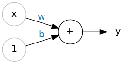
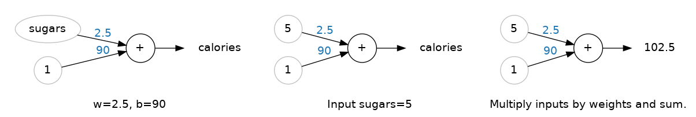
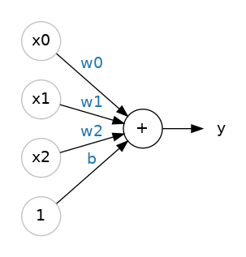

# Una sola neurona

Aprendé sobre unidades lineales, los bloques de construcción del deep learning. 

## ¡Bienvenido a Deep Learning!

Bienvenido al curso de Kaggle **Introduction to Deep Learning**. Estás a punto de aprender todo lo que necesitás para empezar a construir tus propias deep neural networks. Usando **Keras** y **TensorFlow** vas a aprender a:

- crear una arquitectura de fully-connected neural network,  
- aplicar neural nets a dos problemas clásicos de ML: **regression** y **classification**,  
- entrenar neural nets con **stochastic gradient descent**, y  
- mejorar el rendimiento con **dropout**, **batch normalization** y otras técnicas.  

Los tutoriales te introducirán a estos temas con ejemplos completos, y luego en los ejercicios, vas a explorar estos temas en más profundidad y aplicarlos a datasets del mundo real.

## ¿Qué es Deep Learning?

Algunos de los avances más impresionantes en inteligencia artificial en los últimos años han sido en el campo del deep learning. Traducción de lenguaje natural, reconocimiento de imágenes y juegos son todas tareas donde los modelos de deep learning han igualado o incluso superado el rendimiento a nivel humano.

Entonces, ¿qué es deep learning? Deep learning es un enfoque de machine learning caracterizado por **pilas profundas de cálculos**. Esta profundidad de cómputo es lo que ha permitido a los modelos de deep learning desentrañar los tipos de patrones complejos y jerárquicos que se encuentran en los datasets más desafiantes del mundo real.

Gracias a su poder y escalabilidad, las neural networks se han convertido en el modelo definitorio del deep learning. Las neural networks están compuestas de neuronas, donde cada neurona individualmente realiza solo un cálculo simple. El poder de una neural network proviene de la complejidad de las conexiones que estas neuronas pueden formar.

## La unidad lineal

Comencemos con el componente fundamental de una neural network: la neurona individual. Como diagrama, una neurona (o unidad) con una entrada se ve así:



La unidad lineal: \[y = w x + b\]

La entrada es \(x\). Su conexión con la neurona tiene un peso \(w\). Cada vez que un valor fluye a través de una conexión, multiplicás el valor por el peso de la conexión. Para la entrada \(x\), lo que llega a la neurona es \(w \cdot x\). Una neural network "aprende" modificando sus pesos.

El \(b\) es un tipo especial de peso que llamamos **bias**. El bias no tiene ningún dato de entrada asociado; en su lugar, ponemos un 1 en el diagrama para que el valor que llegue a la neurona sea simplemente \(b\) (ya que \(1 \cdot b = b\)). El bias permite a la neurona modificar la salida independientemente de sus entradas.

El \(y\) es el valor que la neurona finalmente produce como salida. Para obtener la salida, la neurona suma todos los valores que recibe a través de sus conexiones. La activación de esta neurona es \[y = w x + b\].

    ¿La fórmula \(y = w x + b\) te resulta familiar?

    ¡Es la ecuación de una línea! Es la **ecuación de pendiente-intersección**, donde \(w\) es la pendiente y \(b\) es la intersección con el eje \(y\).

## Ejemplo – La unidad lineal como modelo

Aunque las neuronas individuales generalmente funcionan solo como parte de una red más grande, a menudo es útil comenzar con un modelo de neurona única como línea base. Los modelos de neurona única son **modelos lineales**.

Pensemos en cómo esto podría funcionar en un dataset como **80 Cereals**. Entrenando un modelo con `'sugars'` (gramos de azúcar por porción) como entrada y `'calories'` (calorías por porción) como salida, podríamos encontrar que el bias es \(b = 90\) y el peso es \(w = 2.5\). Podríamos estimar el contenido calórico de un cereal con 5 gramos de azúcar por porción así:



Cálculo con la unidad lineal.

Y verificando con nuestra fórmula: \[ calories = 2.5 \times 5 + 90 = 102.5\] exactamente como esperábamos.

## Múltiples entradas

El dataset **80 Cereals** tiene muchas más características además de `'sugars'`. ¿Qué pasaría si quisiéramos expandir nuestro modelo para incluir cosas como fibra o contenido proteico? Eso es bastante sencillo. Simplemente podemos agregar más conexiones de entrada a la neurona, una por cada característica adicional. Para encontrar la salida, multiplicamos cada entrada por el peso de su conexión y luego las sumamos todas.



Una unidad lineal con tres entradas.

La fórmula para esta neurona sería \[ y = w_0 x_0 + w_1 x_1 + w_2 x_2 + b \]. Una unidad lineal con dos entradas ajustará un **plano**, y una unidad con más entradas que eso ajustará un **hiperplano**.

## Unidades lineales en Keras

La forma más sencilla de crear un modelo en Keras es a través de `keras.Sequential`, que crea una neural network como una pila de capas. Podemos crear modelos como los de arriba usando una **dense layer** (sobre la cual aprenderemos más en la próxima lección).

Podríamos definir un modelo lineal que acepte tres características de entrada (`'sugars'`, `'fiber'` y `'protein'`) y produzca una única salida (`'calories'`) así:

```python
from tensorflow import keras
from tensorflow.keras import layers

# Crear una red con 1 unidad lineal
model = keras.Sequential([
    layers.Dense(units=1, input_shape=[3])
])
````

Con el primer argumento, `units`, definimos cuántas salidas queremos. En este caso, solo estamos prediciendo `'calories'`, así que usamos `units=1`.

Con el segundo argumento, `input_shape`, le decimos a Keras las dimensiones de las entradas. Establecer `input_shape=[3]` asegura que el modelo acepte tres características como entrada (`'sugars'`, `'fiber'` y `'protein'`).

¡Este modelo ya está listo para ser ajustado a datos de entrenamiento!

    ¿Por qué `input_shape` es una lista de Python?

    Los datos que usaremos en este curso serán datos tabulares, como en un dataframe de Pandas. Vamos a tener una entrada por cada característica en el dataset. Las características están organizadas por columna, así que siempre tendremos:

    $$
    input\_shape = [num\_columns]
    $$

    La razón por la que Keras usa una lista aquí es para permitir el uso de datasets más complejos. Los datos de imágenes, por ejemplo, podrían necesitar tres dimensiones: $[height, width, channels]$.